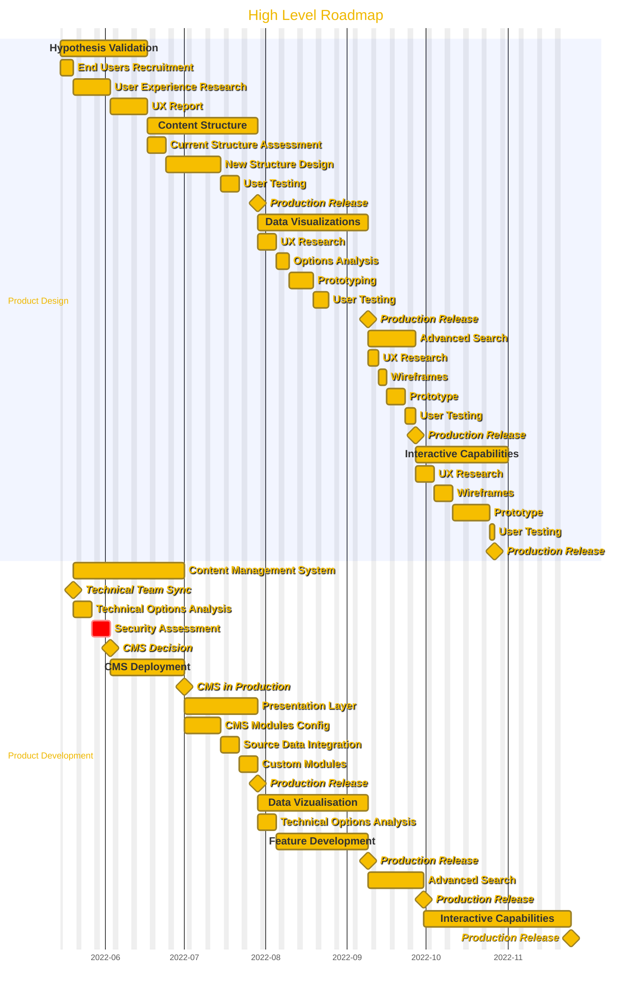

# High Level Roadmap

- [High Level Roadmap](#high-level-roadmap)
  - [Product Design](#product-design)
    - [Hypothesis Validation](#hypothesis-validation)
    - [Content Structure](#content-structure)
    - [Data Vizualisation](#data-vizualisation)
    - [Advanced Search](#advanced-search)
    - [Interactive Capabilities](#interactive-capabilities)
  - [Product Development](#product-development)
    - [Content Management System (CMS)](#content-management-system-cms)
    - [Presentation Layer](#presentation-layer)
    - [Visualizations](#visualizations)
    - [Search](#search)
    - [Interactive Functionalities](#interactive-functionalities)

## Product Design

Typically, the following actors will be required for the product design:

- Product Manager
- Content Designer
- Service Designer
- User Experience Researcher
- End Users

All the milestones in the Design swimlane align with milestones in the Development one.
The reason is that although they may require different skills and methodologies, they should be conducted simultaneously by a multidisciplinary team.

This means that if the product developers have their substantiary position with an IT branch or a private company, a clear understanding that everyone must work together as a single team is required for a successful Agile delivery of the product.

### Hypothesis Validation

The first milestone would be to validate the hypothesis defined by the product team by conducting a User Experience Research.
This is considered the Discovery stage.

While a lot of information may be gathered at this step, there wouldn't necessarily be any technical deployment visible to the end users yet.
However, the development team would already be heavily involved in analyzing and choosing the best technical tools to support an interactive product development.

### Content Structure

The second milestone would be to design the content structure and validate the changes with end users.

### Data Vizualisation

The third milestone would be to design data vizualisation and validate the proposed changes with end users.

### Advanced Search

The fourth milestone would be to design an advanced search feature and validate it with end users.

### Interactive Capabilities

The last milestone is actually a possible series of additional milestones.
The reason here is that as the product evolves over time and features are added, user feedback will provide valuable and tangible information as to what other capabilities are required to meet their needs.

## Product Development

Typically, the following actors will be required for the product design:

- Developers
- System Administrators

Whoever will be part of the development and operations team must be onboard early on and throughout the entire product development life cyle.
Multiple "short projects" can be used to secure internal IT staff's time if the product team does not have developers embedded with them.

The product roadmap should provide sufficient work level estimates but not consist in a business requirements document since short development cycles will be leveraged to course correct based on end users needs and feedback.

### Content Management System (CMS)

The first milestone on the product development front would be to settle on a content management system that supports flexible configuration out of the box and deploying it for the product team.

Note: This milestone also includes an integration stage with the data source via an API so that the product team can focus on the presentation layer instead of data formatting.

### Presentation Layer

The second milestone would be to configure the CMS to meet the content design needs.

If out of the box configurations are not meeting all the needs, additional modules could be developed.

### Visualizations

The third milestone would be to configure the CMS to meet the Visualizations needs identified by the end users.

If out of the box features are not meeting all the requirements, extensive open source vizualisation libraries can be leveraged to ensure rapid prototyping and ensuring flexibility for future needs.

### Search

The fourth milestone would be to configure the CMS to meet the search functionalities identified in the user experience research.

While most modern CMS offer out of the box search features, the development team might need to look at enhancing those with additional open source libraries or Software as a Service (SaaS) offerings.

### Interactive Functionalities

The fifth milestone would be further fleshed out by the continuous user feedback throughout the entire length of the product development life cycle.

As new needs are surfaced, further technical analysis would be required and features development planned accordingly.
