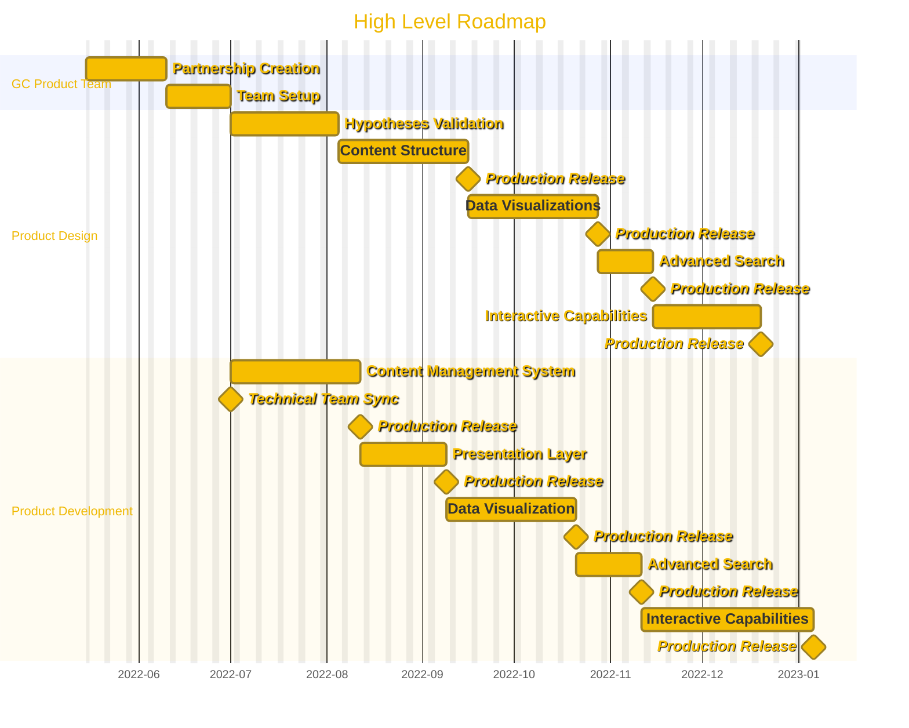
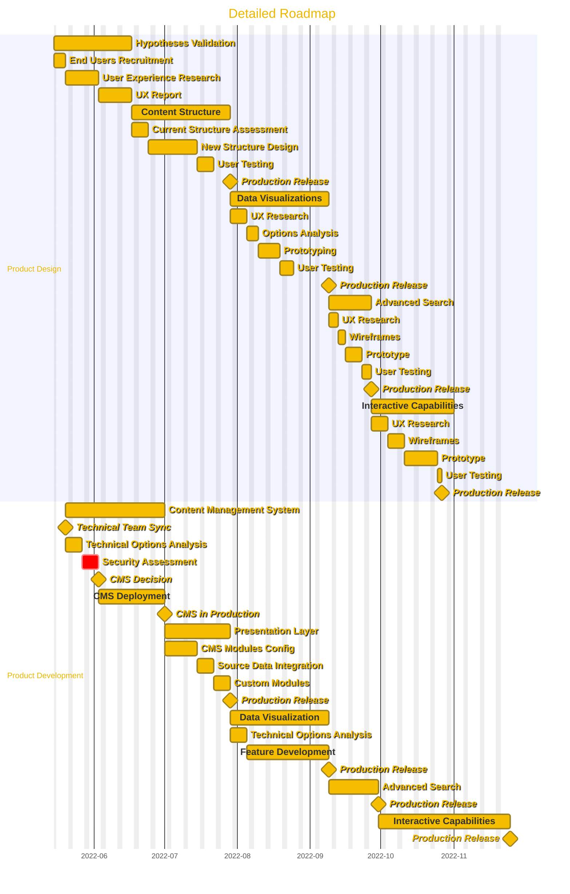

# High Level Roadmap

- [High Level Roadmap](#high-level-roadmap)
  - [GC Product Team](#gc-product-team)
    - [Partnership Creation](#partnership-creation)
    - [Team Setup](#team-setup)
  - [Product Design](#product-design)
    - [Hypotheses Validation](#hypotheses-validation)
    - [Content Structure](#content-structure)
    - [Data Visualization](#data-visualization)
    - [Advanced Search](#advanced-search)
    - [Interactive Capabilities](#interactive-capabilities)
  - [Product Development](#product-development)
    - [Content Management System (CMS)](#content-management-system-cms)
    - [Presentation Layer](#presentation-layer)
    - [Visualizations](#visualizations)
    - [Search](#search)
    - [Interactive Functionalities](#interactive-functionalities)
  - [Detailed Roadmap](#detailed-roadmap)

## GC Product Team

This set of phases has been added specifically with the goal to highlight the key steps to establish a product team in the GC context.

While committees and working groups can be useful to coordinate internal feedback, establishing a core team responsible to drive the development and the continuous improvement of a product would provide faster value with less risks associated with traditional technology enabled projects.

This is aligned with the following [Digital Standards](https://www.canada.ca/en/government/system/digital-government/government-canada-digital-standards.html):

- Design with users
- Iterate and improve frequently
- Use open standards and solutions
- Empower staff to deliver better services

### Partnership Creation

This milestone aims to address the gap program branches face when trying to establish product management teams.
While program teams have their own set of responsibilities related to the mandate of the organization, most IT related functions are provided by a corporate branch, meaning that negotiations on priorities and technology choices have to be made in collaboration.

Large departments have many competing priorities and it may require a lot of planning ahead of getting access to key talent from an IT branch.

Securing the collaboration through a partnership may be possible if a clear roadmap is established with sufficient funding secured for both the operation of the program as well as its underlying technology continuous improvements.

### Team Setup

While some developers may be provided by the corporate IT branch, there might not be sufficient availability to meet the desired timelines or the departmental demand.

This means that part of the team might require to be contracted out to the private sector, which could add delays.

## Product Design

Typically, the following actors will be required for the product design:

- Product Manager
- Content Designer
- Service Designer
- User Experience Researcher
- End Users

All the milestones in the Design swimlane align with milestones in the Development one.
The reason is that although they may require different skills and methodologies, they should be conducted simultaneously by a multidisciplinary team.

This means that if the product developers have their substantiary position with an IT branch or a private company, a clear understanding that everyone must work together as a single team is required for a successful Agile delivery of the product.

### Hypotheses Validation

The first milestone would be to validate the hypotheses defined by the product team by conducting a User Experience Research.
This is considered the Discovery stage.

While a lot of information may be gathered at this step, there wouldn't necessarily be any technical deployment visible to the end users yet.
However, the development team would already be heavily involved in analyzing and choosing the best technical tools to support an interactive product development.

### Content Structure

The second milestone would be to design the content structure and validate the changes with end users.

### Data Visualization

The third milestone would be to design data Visualization and validate the proposed changes with end users.

### Advanced Search

The fourth milestone would be to design an advanced search feature and validate it with end users.

### Interactive Capabilities

The last milestone is actually a possible series of additional milestones.
The reason here is that as the product evolves over time and features are added, user feedback will provide valuable and tangible information as to what other capabilities are required to meet their needs.

## Product Development

Typically, the following actors will be required for the product development:

- Product Manager
- Developers
- System Administrators

Whoever will be part of the development and operations team must be onboard early on and throughout the entire product development life cyle.
Multiple "short projects" can be used to secure internal IT staff's time if the product team does not have developers embedded with them.

The product roadmap should provide sufficient work level estimates but not consist in a business requirements document since short development cycles will be leveraged to course correct based on end users needs and feedback.

While the development timelines could be reasonably short in the private sector, there might be some challenges around getting access to development, staging and production environments solely controlled by the product team.
Most departments will require a separation of duty, typically across different teams, not just individuals, which means that although development could be conducted outside of the production environment, migrating the product in production among other systems will require planning ahead.

As such, a product team would need to properly establish a development pipeline that meets other teams requirements so that back and forth are minimized.
Some departments may have documentation available or already have built such development pipelines.
Either way, reaching out to the corporate's IT branch at the beginning of the initiative may identify key requirements to address upfront.

For example, if specific software is acquired, either as an open source component or purchased from a vendor, a Security Assessment and Authorization would be required before it can be used in production.

The risk levels associated with operating a product consisting of various software components need to be assessed so that the department can make an educated decision on whether to grant the product team the Authority to Operate or not.

### Content Management System (CMS)

The first milestone on the product development front would be to settle on a content management system that supports flexible configuration out of the box and deploying it for the product team.

Note: This milestone also includes an integration stage with the data source via an API so that the product team can focus on the presentation layer instead of data formatting.

### Presentation Layer

The second milestone would be to configure the CMS to meet the content design needs.

If out of the box configurations are not meeting all the needs, additional modules could be developed.

### Visualizations

The third milestone would be to configure the CMS to meet the Visualizations needs identified by the end users.

If out of the box features are not meeting all the requirements, extensive open source Visualization libraries can be leveraged to ensure rapid prototyping and ensuring flexibility for future needs.

### Search

The fourth milestone would be to configure the CMS to meet the search functionalities identified in the user experience research.

While most modern CMS offer out of the box search features, the development team might need to look at enhancing those with additional open source libraries or Software as a Service (SaaS) offerings.

### Interactive Functionalities

The fifth milestone would be further fleshed out by the continuous user feedback throughout the entire length of the product development life cycle.

As new needs are surfaced, further technical analysis would be required and features development planned accordingly.

## Detailed Roadmap

This roadmap dives deeper in each primary milestones and explores the needed steps to successfully develop a web based product.

(Work in progress)

