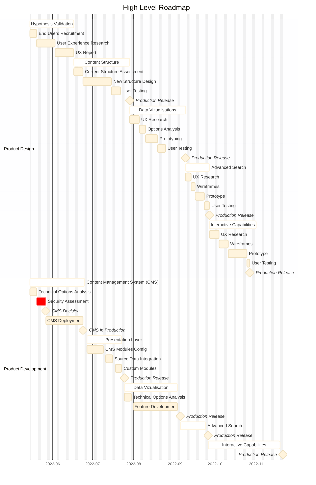

# High Level Roadmap

- [High Level Roadmap](#high-level-roadmap)
  - [Product Design](#product-design)
    - [Hypothesis Validation](#hypothesis-validation)
    - [Content Structure](#content-structure)
    - [Data Vizualisation](#data-vizualisation)
    - [Advanced Search](#advanced-search)
    - [Interactive Capabilities](#interactive-capabilities)
  - [Product Development](#product-development)
    - [Content Management System (CMS)](#content-management-system-cms)
    - [Presentation Layer](#presentation-layer)
    - [Vizualisations](#vizualisations)
    - [Search](#search)
    - [Interactive Functionalities](#interactive-functionalities)

## Product Design

Typically, the following actors will be required for the product design:

- Product Manager
- Content Designer
- Service Designer
- User Experience Researcher
- End Users

### Hypothesis Validation

### Content Structure

### Data Vizualisation

### Advanced Search

### Interactive Capabilities

## Product Development

Typically, the following actors will be required for the product design:

- Developers
- System Administrators

### Content Management System (CMS)

### Presentation Layer

### Vizualisations

### Search

### Interactive Functionalities

