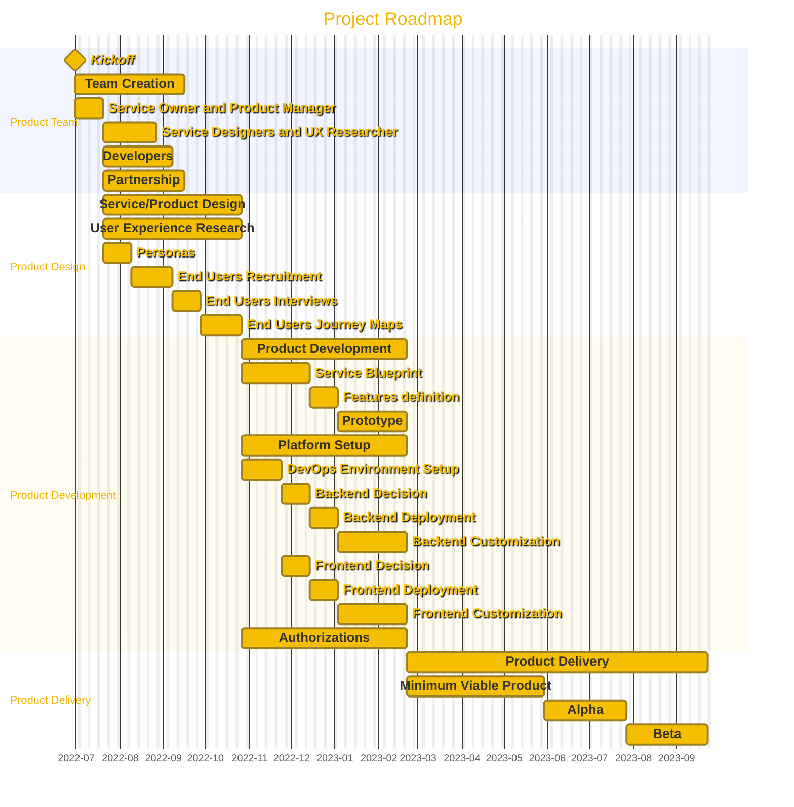

# Project Roadmap

```mermaid
%%{init: {"theme": "base", "themeVariables": { "primaryColor": "#F6BE00" }, "themeCSS": ".taskText { font-size:13px; font-weight: bold} .taskTextOutsideRight { font-size:13px; fill: #F6BE00; text-shadow: 1px 1px 1px black; font-weight: bold;} .taskTextOutsideLeft { font-size:13px; fill: #F6BE00; text-shadow: 0.5px 0.5px 0.5px black; font-weight: bold;} .section {opacity:0.05} "}}%%
gantt
    title Project Roadmap
    dateFormat  YYYY-MM-DD
    axisFormat  %Y-%m
    excludes    weekends
    todayMarker off

    section Product Team

    Kickoff: milestone, kickoff, 2022-06-30, 0d
    Team Creation :  team1, after kickoff, 8w
    Service Owner and Product Manager: team2, after kickoff, 2w
    Service Designers and UX Researcher: team3, after team2, 4w
    Developers: team4, after team2, 5w
    Partnership : team5, after team2, 6w

    section Product Design

    Service/Product Design: design1, after team2,10w
    User Experience Research: design2, after team2, 10w
    Personas: after team2, 2w
    End Users Recruitment: 3w
    End Users Interviews: 2w
    End Users Journey Maps : 3w

    section Product Development

    Product Development: dev1, after design1, 12w
    
    Service Blueprint: after design1, 5w
    Features definition: 2w
    Prototype: 5w

    Platform Setup: after design1, 12w
    DevOps Environment Setup: dev2, after design1, 3w
    Backend Decision: after dev2, 2w
    Backend Deployment: 2w
    Backend Customization: 5w
    Frontend Decision: after dev2, 2w
    Frontend Deployment: 2w
    Frontend Customization: 5w
    Authorizations: after design1, 12w

    section Product Delivery

    Product Delivery: delivery1, after dev1, 22w
    Minimum Viable Product: delivery2, after dev1, 10w
    Alpha: delivery3, after delivery2, 6w
    Beta: delivery4, after delivery3, 6w

    
```
